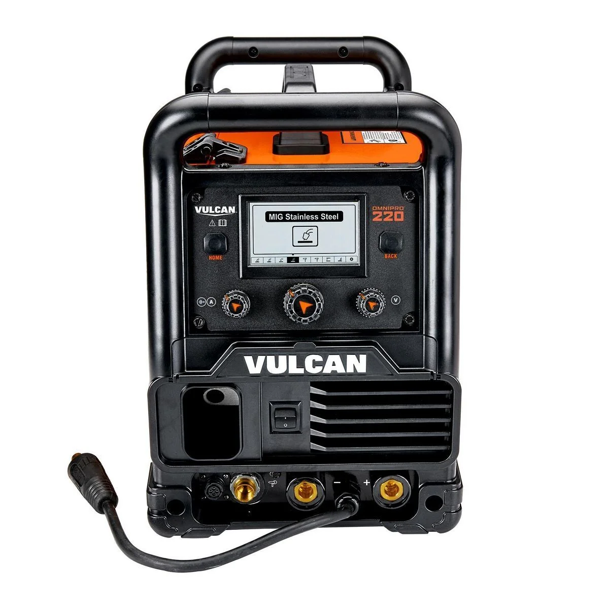
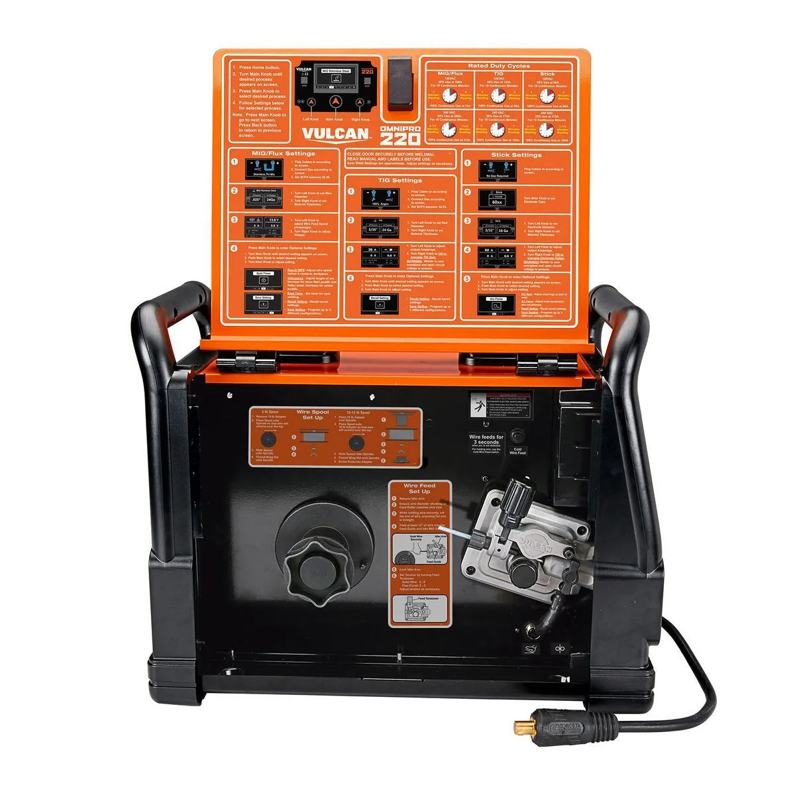
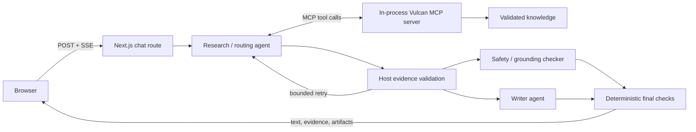
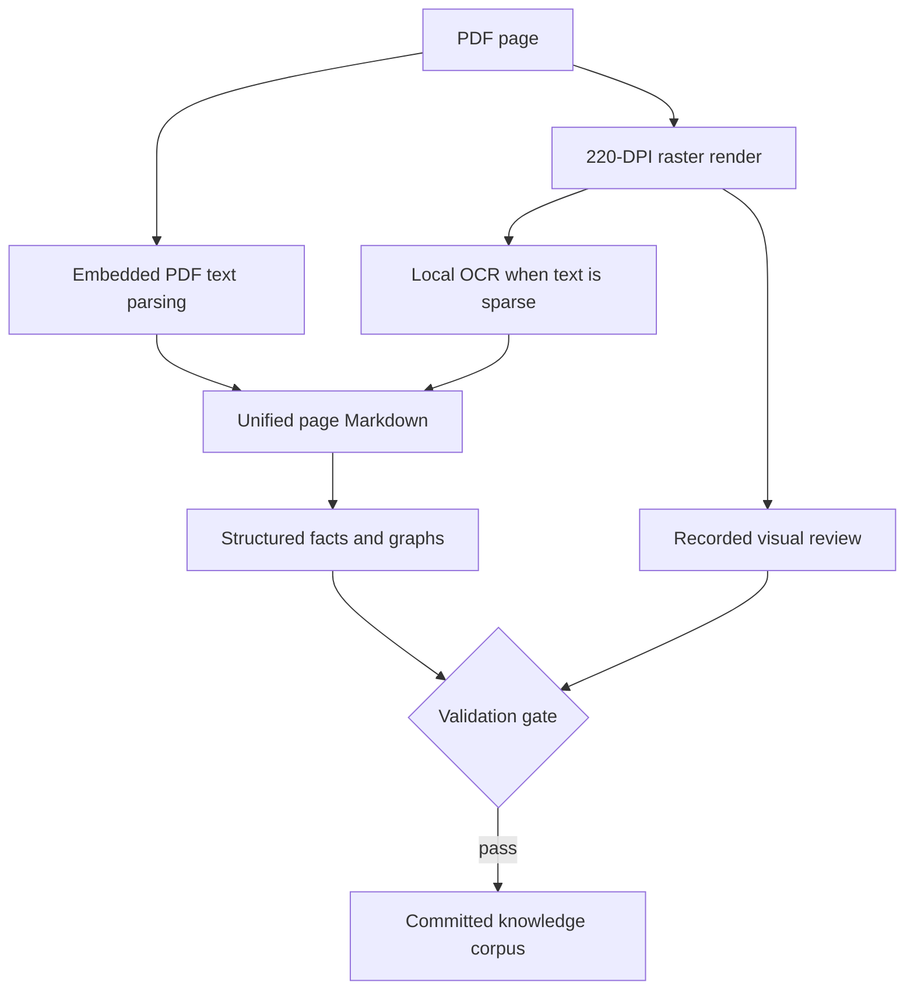

# Arc

Arc is a multimodal support agent for the Vulcan OmniPro 220 welder. It answers
machine-specific questions from a visually verified knowledge base, refuses to invent
missing repair guidance, and turns validated evidence into interactive setup,
troubleshooting, source-image, polarity, and duty-cycle artifacts.

<p align="center">
  
  
</p>

The interface is designed for someone standing beside the machine: concise chat on one
side, and a zoomable front/inside component explorer when spatial context matters.

## What it can do

- Look up exact duty cycles, current ranges, open-circuit voltage, wire speed, spool
  capacity, and polarity without relying on model memory.
- Build process-specific setup checklists and cable/polarity maps.
- Traverse a source-backed troubleshooting graph and render an interactive flow.
- Recommend MIG, flux-cored, TIG, or Stick from the supplied selection chart.
- Show the exact reviewed manual page or product image behind an answer.
- Apply deterministic job-risk, power-source, fault-indicator, and repair-scope rules.
- Explore 22 labeled components across the machine's front and open-door views.

## How the agent works

Arc separates language-model judgment from machine facts. Claude decides which capability
is relevant and how to communicate the result; deterministic TypeScript owns the facts,
safety states, provenance, and artifact data.



### 1. Routing and MCP

The Next.js API receives a question and streams progress with server-sent events. A cheap
host-side preflight identifies mandatory capabilities such as an exact specification,
safety assessment, power-source check, repair-scope check, or documented symptom.

The research agent then receives an in-process MCP server created with
`createSdkMcpServer`. It sees schema-constrained tools under one `vulcan` namespace:

| MCP tool | Responsibility |
|---|---|
| `lookup_spec` | Exact structured machine specifications |
| `search_manual` | Focused retrieval over reviewed page Markdown |
| `get_setup` | Process-specific cables, consumables, startup, and shutdown |
| `diagnose_problem` | Documented symptom/cause/check/remedy graph |
| `recommend_process` | Constraint-based process selection |
| `lookup_fault_indicator` | Exact documented display conditions; unknown codes fail closed |
| `assess_job_risk` | Deterministic hazardous-work rules |
| `assess_power_source` | Outlet, circuit, grounding, and unsupported-source checks |
| `check_repair_scope` | Operator versus qualified-technician boundaries |
| `get_source_page` | Reviewed PDF or product-image render lookup |
| `emit_artifact` | Grounded duty-cycle calculator only |

This is a real MCP boundary without a localhost sidecar: the server and tool handlers live
inside the agent worker process. The model can select a capability, but it cannot edit the
knowledge base or manufacture a tool result.

### 2. Evidence verification and retry

A successful MCP response is not trusted merely because a tool call completed. Arc watches
the Agent SDK event stream and independently recomputes each result with the same validated
host function. It then checks:

- tool input against its Zod schema;
- result equality and provenance against the committed knowledge revision;
- required safety or routing evidence for the actual question;
- exact numeric intent for specification questions;
- artifact parameters against the evidence that produced them;
- contradictory, missing, duplicated, or unsupported results.

Recoverable failures return precise feedback to one bounded research retry. Successful
calls and their evidence survive the retry, and byte-identical calls are deduplicated so a
repair attempt does not pay for the same lookup twice. If evidence is still incomplete,
the request ends as an error rather than releasing a plausible answer.

### 3. Checker and writer

After research passes, generation is deliberately split:

- The **safety/grounding checker** has no tools. For risk-signaled questions it converts
  verified evidence into an approved response plan and cannot weaken the deterministic
  safety disposition.
- The **writer** also has no tools. It receives only verified evidence IDs and the approved
  plan, and must attach the smallest supporting evidence set to each paragraph.
- A final deterministic validator rejects uncited paragraphs, new numbers, unsupported
  safety claims, missing stop language, or artifact values that do not match a lookup.

The first writer pass runs in parallel with the model safety checker when that checker is
needed. Exact low-risk specifications skip both extra model stages and render directly
from the matched lookup. A documented troubleshooting result renders directly as a
host-generated flow instead of asking another model to paraphrase it.

Nothing is shown as complete until the evidence, checker, writer, and artifact validations
all pass.

## Building a visually verified knowledge base

The supplied sources contain 51 PDF pages across an owner's manual, quick-start guide, and
process-selection chart, plus the supplied product photography. Important information is
not consistently available as text: cable polarity is drawn, troubleshooting rows encode
relationships spatially, and the selection chart is effectively an image.

Arc therefore builds two independent representations of each PDF page:



PDF pages are rasterized to lossless PNG rather than lossy JPEG so small table rules,
labels, and OCR inputs stay sharp. The reviewer-facing cross-comparison boards are JPEG
images under `assets/reference-images/validation/`. In other words, the semantic PDF parse
is checked against what a person can actually see on the rasterized page; neither layer is
accepted as the sole truth for complex pages.

The extraction build records:

- deterministic embedded-text extraction;
- page classification as text-only or visually complex;
- full and whitespace-cropped 220-DPI renders;
- OCR text, bounding boxes, confidence, and render hash;
- a human visual-review record for every complex page and source image;
- SHA-256 source hashes and exact page-level provenance;
- structured facts, setup records, decision profiles, and troubleshooting nodes;
- a validation report that fails the build on unresolved reviews or invalid source links.

Current extraction status: **54/54 visual sources reviewed**, **0 unresolved reviews**, and
**0 invalid structured source references**. See
[`knowledge/validation/report.md`](knowledge/validation/report.md).

## The 2.5D component explorer

A conventional 3D model would have replaced source evidence with an approximation. Arc
instead keeps the real product pixels and adds a camera plus source-backed SVG geometry:
the result feels spatial and zoomable while remaining faithful to the machine.

### Front view

The front photograph is close to orthographic, so labeled anchors from the manual's page-8
line drawing are projected into photo space with a planar homography. Four control points
fit the transform; a fifth point is withheld from fitting and must land within the allowed
error. The committed build's held-out error is **5.78 px**.

The lower socket strip is nearly collinear, which cannot determine a stable homography.
Those components are measured directly in the photograph instead of forcing a mathematically
invalid projection. Every hotspot records whether it was `projected` or `measured`.

### Inside view

The open-door photograph has stronger perspective and parts at different depths. A single
planar transform was explicitly rejected after scale checks disagreed across the spool,
roller, switch, and knob. The inside hotspots are therefore measured directly against the
photograph and cross-referenced with the manual's page-9 callouts.

The viewer never resamples the source photograph. A composed translate-and-scale camera
zooms toward each normalized hotspot, SVG shapes remain aligned with the image, and users
can wheel-zoom, drag, switch views, or inspect each component's descriptive and positional
provenance.

Audit images:

- [`front-correspondences.jpg`](assets/reference-images/validation/front-correspondences.jpg)
- [`inside-cross-comparison.jpg`](assets/reference-images/validation/inside-cross-comparison.jpg)

## Grounded artifacts

Models never generate executable React or arbitrary diagram syntax. The host derives typed
artifact data from successful evidence and renders it with allowlisted components:

- duty-cycle timeline;
- reviewed source image;
- setup checklist;
- polarity/cable map;
- troubleshooting flow generated from validated graph nodes and edges.

That keeps presentation flexible while facts and safety boundaries remain deterministic.

## Repository map

```text
app/                         Next.js pages and streaming API routes
assets/reference-images/    Organized product, calibration, validation, and brand inputs
components/                  Chat, 2.5D explorer, and artifact renderers
files/                       Original source PDFs
knowledge/                   Generated and validated deployment corpus
lib/agent/                   MCP tools, orchestration, verification, and writer pipeline
scripts/                     Extraction, geometry, evaluation, and source datasets
tests/                       Deterministic agent and grounding tests
evals/                       Semantic evaluation questions and retained final reports
```

## Run locally

Requirements: Node.js 20.9+ and an Anthropic API key.

```bash
cp .env.example .env
# Set ANTHROPIC_API_KEY in .env
npm ci
npm run dev
```

Open `http://localhost:3000`.

Useful checks:

```bash
npm run typecheck
npm test
npm run build
```

Rebuild and validate the knowledge corpus:

```bash
python -m venv .venv
# Windows: .venv\Scripts\pip install -r requirements-extraction.txt
# macOS/Linux: .venv/bin/pip install -r requirements-extraction.txt
python scripts/extract_knowledge.py --require-reviewed
python -m unittest scripts.test_extraction
```

## Deploy at `zouhari.dev/arc`

The UI and source-asset routes are Vercel-ready and support a build-time base path:

```text
NEXT_PUBLIC_BASE_PATH=/arc
```

Next.js inlines `basePath` during the build, so set it for Preview and Production before
deploying. The app will then live at `https://<project>.vercel.app/arc`, including its API
and static asset paths. The main `zouhari.dev` project can rewrite `/arc` and
`/arc/:path*` to that deployment using Vercel Multi-Zone routing.

For example, in the main site's `next.config.ts`:

```ts
const arcOrigin = process.env.ARC_ORIGIN!;

export default {
  async rewrites() {
    return [
      { source: "/arc", destination: `${arcOrigin}/arc` },
      { source: "/arc/:path*", destination: `${arcOrigin}/arc/:path*` },
    ];
  },
};
```

Set `ARC_ORIGIN` on the main site to the Arc project's Vercel origin, without a trailing
slash.

### Why the production agent uses a worker

The Claude Agent SDK is a process-based SDK and its resumable sessions live on the local
filesystem. A Vercel function can stream the Next.js response, but its instance and disk
are not a durable owner for a multi-turn Agent SDK session. Production therefore uses:

```text
zouhari.dev/arc -> Vercel Next.js app -> SSE proxy -> persistent Arc container
```

Build the included worker image from the same repository:

```bash
docker build -t arc-agent .
docker run --rm -p 3000:3000 \
  -e ANTHROPIC_API_KEY=your-key \
  -e ARC_PUBLIC_BASE_PATH=/arc \
  arc-agent
```

Host that container on a persistent container platform, then set this server-only Vercel
environment variable:

```text
AGENT_BACKEND_URL=https://your-agent-worker.example.com
```

`ARC_PUBLIC_BASE_PATH=/arc` belongs on the worker. It makes source-image artifacts point
back through the public frontend's `/arc/api/source-assets` route even though the worker's
own Next.js server is mounted at `/`.

That mount point is why the worker image takes no build argument here. To build an image
whose own server is mounted under the sub-path instead — a single container with no Vercel
frontend in front of it — pass the prefix at build time, since Next inlines it into the
client bundle:

```bash
docker build -t arc-agent --build-arg NEXT_PUBLIC_BASE_PATH=/arc .
```

When the variable is present, `/api/chat` validates the request and transparently proxies
the upstream SSE stream. When it is absent, local development runs the Agent SDK directly
inside the Next.js server. Keep `ANTHROPIC_API_KEY` on the worker only, never in a
`NEXT_PUBLIC_*` variable.

Before opening the demo broadly, add an upstream request-rate or spend limit appropriate
to your Anthropic account. Arc already applies per-stage budgets and bounded retries, but
those limits protect one request rather than an entire public deployment.

Deployment references:

- [Claude Agent SDK hosting model](https://platform.claude.com/cookbook/claude-agent-sdk-07-hosting-the-agent)
- [Next.js `basePath`](https://nextjs.org/docs/pages/api-reference/config/next-config-js/basePath)
- [Vercel multi-project subpath routing](https://vercel.com/kb/guide/how-can-i-serve-multiple-projects-under-a-single-domain)

## Evaluation snapshot

- Deterministic tests: **73/73 passing**
- Final live troubleshooting suite: **6/6 passing**
- Tool-routing assertions: **7/7 passing**
- Artifact-routing assertions: **6/6 passing**

The retained report is
[`evals/results/troubleshooting-flow-semantic-final-2026-08-26.md`](evals/results/troubleshooting-flow-semantic-final-2026-08-26.md).
